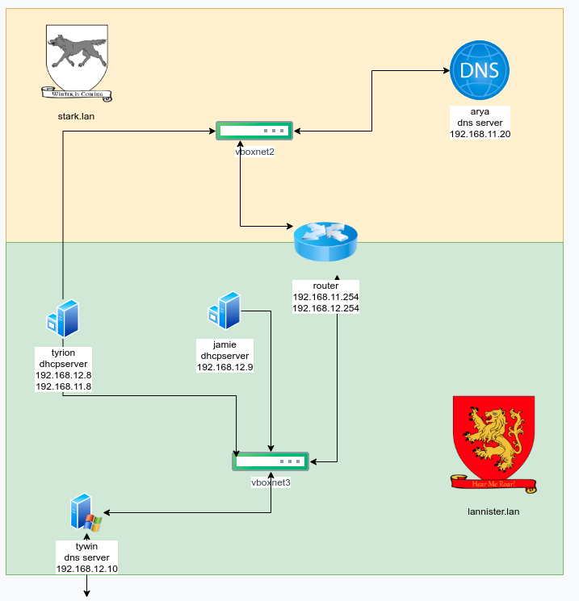

## Tarefa 2.1 - Servidores DHCP Windows

Os equipos ned, rob serán os servidores dns para o dominio stark.lan (Debian) e twin para lanister.lan (Windows)

Instala no equipo tyrion (Windows) o rol de servidor DHCP coa seguinte configuración: (deberás ter apagados os servidores DHCP do punto anterior)

1. Un ámbito para os equipos da rede privada lanister, con un intervalo de exclusión.

2. Deberás crear unha reserva estática que estará no rango de enderezos do seu ámbito correspondente.

3. Establece os nomes de dominio e servidores DNS primario de cada zona.

4. Deberás actualizar a zona primaria no servidor DNS tywin.

5. Engade outro ámbito para a rede primaria stark (necesitas outra interface de rede) que actualice a zona prinaria DNS definida no equipo arya.

6. Instala no equipo jaime un servizo DHCP failover para a subrede lanister.

7. Necesitarás polo menos tres clientes (Cercei,Joffrey, Myrcella) para a rede lannister e un para a  rede stark (jon).
Inclúe capturas de:
    - Configuración dos ambitos e rangos de enderezos

    - Configuración de opcións

    - Configuración da actualización

    - Vídeo no que o cliente renova a concesión, e se ve  a zona DNS unha vez que o DHCP actualiza o DNS. Tamén o cliente debe ser capaz de resolver o seu propio nome (non FQDN).

    - Clientes das dúas subredes, amosando DNS, router e enderezo IP.

    - Configuración dos servidores failover

    - Capturas dos clientes obtendo enderezos cos dous servidores failover encendidos, e con un acendido e outro apagado (de forma alterna)

**SOLUCION:**

- Configuración de DNS en Servidores Debian (Ned y Rob) para stark.lan (os pasos débense facer en Ned y Rob, ainda que só o mostro como se fai nun, xa que no outro será identico)

    - Instalamos Bind9

        
    
    - Configuramos a zona DNS

        

    - Creamos o arquivo de zona

        

- Configuración de DNS en Windows Server (Tywin) para lannister.lan

    - Instalamos servidor DNS en Tywin

        
    
    - Creamos a zona de búsqueda directa lannister.lan permitindo actualizacións dinámicas

        

- Configuración de DHCP en tyron para ambas subredes

    - Configuramos un ámbito para lannister.lan

        

    - Configuramos un ámbito para stark.lan

        
    
- Configuración de Failover DHCP en Jaime para lannister.lan

    - Configuramos Failover DHCP con Tyrion

        